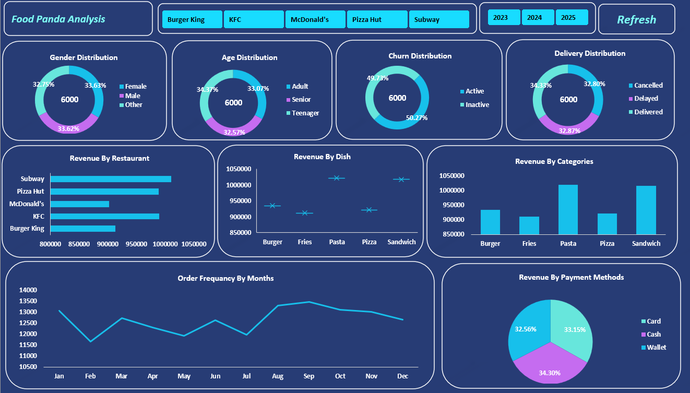

# 📊 Power BI–Style Excel Dashboard

## 🔎 Project Overview
This project demonstrates an **end-to-end Excel dashboard workflow** built using **Power Query, Pivot Tables, Slicers, and VBA**.  
The dashboard provides interactive analysis and includes a **Power BI–style Refresh / Reset button** that clears all slicer filters and restores the dashboard to its default view in a single click.

---

## 🛠 Tools & Technologies
- Microsoft Excel  
- Power Query (Data Cleaning & Transformation)  
- Pivot Tables & Pivot Charts  
- Slicers  
- VBA (for refresh automation)

---

## 📂 Project Structure
| File / Folder    | File Name                        | Description                                                                                                                                          |
| ---------------- | -------------------------------- | ---------------------------------------------------------------------------------------------------------------------------------------------------- |
| 📁 **data**      | `Foodpanda Analysis Dataset.csv` | Raw dataset used for the project. This file contains unprocessed data before cleaning and transformation in Power Query.                             |
| 📁 **project**   | `FoodPanda Analysis.xlsm`        | Main Excel project file. Includes Power Query transformations, Pivot Tables, interactive dashboard, slicers, and VBA-based refresh/reset automation. |
| 📁 **dashboard** | `dashboard_preview.png`          | Screenshot image of the final Power BI–style Excel dashboard for quick preview on GitHub.                                                            |

---

## 🔄 Complete Working Process

### 1️⃣ Data Loading & Cleaning (Power Query)
- Raw data is loaded into Excel using **Power Query**.
- Unstructured and inconsistent **date formats are corrected**.
- Basic data cleaning and transformations are performed.
- Cleaned data is then **loaded into Excel** for analysis.

---

### 2️⃣ Feature Engineering (Year Extraction)
- After loading the cleaned data:
  - **Year is extracted from the Order Date column**.
- This enables:
  - Year-wise analysis
  - Year-based slicer functionality

---

### 3️⃣ Pivot Table Creation
- Pivot Tables are created using the transformed data to analyze:
  - Order frequency trends
  - Monthly performance
  - Category / restaurant-level insights
- All charts in the dashboard are **directly connected to Pivot Tables**.

---

### 4️⃣ Dashboard Development
- An interactive dashboard is designed using:
  - Pivot Charts
  - Shapes and layout containers
- The dashboard focuses on:
  - Clean design
  - Easy readability
  - Business-friendly visuals

---

### 5️⃣ Slicer Implementation & Formatting
- Slicers are added for filtering (e.g., Year, Category).
- Each slicer is connected to **multiple Pivot Tables** using Report Connections.
- Slicers are customized with:
  - Proper formatting
  - Consistent colors
  - Dashboard-aligned layout

---

### 6️⃣ Refresh Automation (Key Feature ⭐)
- A **custom Refresh / Reset button** is created using Shapes and VBA.
- The button performs the following actions:
  - Clears all slicer filters
  - Refreshes all Pivot Tables
  - Resets the dashboard to its default state
- This replicates **Power BI’s “Reset to default” functionality** inside Excel.

---

## 🔘 How the Refresh Button Works
1. User applies filters using slicers  
2. Charts update dynamically  
3. User clicks the **Refresh button**  
4. Result:
   - All slicers are cleared
   - All charts reset
   - Dashboard returns to default view  

---

## ⚠️ Important Note
- The dashboard file is a **Macro-Enabled Workbook (.xlsm)**.
- Please **enable macros** after opening the file for full functionality.

---

## 📊 Dashboard Preview

  

## ⭐ Key Highlights
- End-to-end Excel dashboard project
- Power Query–based data cleaning
- Multi-slicer interactive filtering
- One-click dashboard reset using VBA
- Power BI–style user experience in Excel

---

## 🧠 One-Line Summary
Built an interactive Excel dashboard using Power Query, Pivot Tables, and Slicers, featuring a VBA-based refresh button to reset all filters and visuals in a single click.

## 👨‍💻 Author
**Ravi Kumar Gupta**  
📍 Delhi, India  

  

